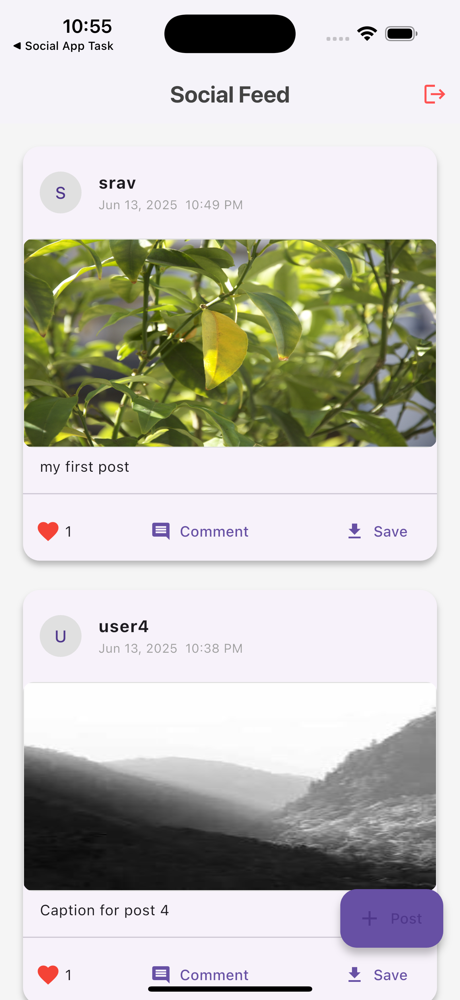
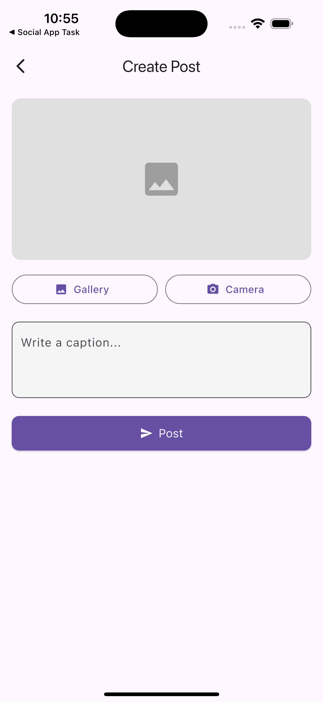
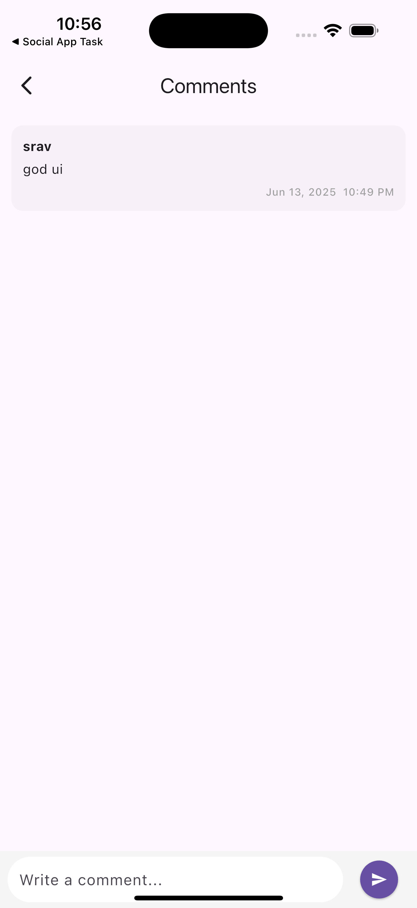

# 📱 InstaFeed – Social Media Feed App with Flutter

A clean, scalable Flutter application that mimics an Instagram-style feed with local storage, offline support, and modern UI/UX interactions.

> 🚀 Developed as part of a technical evaluation to showcase my practical knowledge of Flutter, Bloc pattern, local storage (SQLite), and Flutter best practices. This project demonstrates my ability to architect, manage state, and build visually appealing, responsive apps ready for production.

---

## ✅ Features Implemented

| Feature                           | Description                                                                          |
|-----------------------------------|--------------------------------------------------------------------------------------|
| 🔐 Authentication                 | Simple username-based login using Bloc                                               |
| 🖼️ Post Creation                  | Pick image (camera/gallery), enter caption, and upload                               |
| 📰 Feed UI                        | Real-time feed with post image, caption, timestamp, and user avatar                  |
| ❤️ Like System                     | Tap/double-tap with animated like, per-user like tracking using SQLite               |
| 💬 Comments                       | Add and view comments with timestamp                                                 |
| 📦 Local Storage                  | Fully local database using `sqflite`, includes `users`, `posts`, `likes`, `comments` |
| 📥 Image Downloader               | Save post images to gallery (using `dio`)                                            |
| 📱 Responsive & Modern UI         | Material 3 styling, reusable widgets, smooth scrolling                               |

---

## 📸 Screenshots

| Feed Screen | Create Post | Comments |
|-------------|-------------|----------|
|  |  |  |


---

## 📦 Download APK

You can try the app by downloading the APK directly:

🔗 **[Download APK](https://github.com/codeislife07/flutter_social_app_task/assets/apk/app-release.apk)**  
_(Make sure “Install from unknown sources” is enabled on your Android device.)_

> ✅ Tested on Android 9+ (API 28+). Runs smoothly on physical and emulator devices.

---

## 📸 Screenshots

> Add 2–3 screenshots here like:
-Feed Screen
-Create Post
-Like Animation
-Comment Screen

---

## 🧱 Tech Stack & Libraries

| Package               | Purpose                                      |
|-----------------------|----------------------------------------------|
| `flutter_bloc`        | State management (AuthBloc, FeedBloc)        |
| `sqflite`             | Local DB for storing users, posts, comments  |
| `shared_preferences`  | Local key-value for quick auth               |
| `image_picker`        | Select or capture image from gallery/camera  |
| `intl`                | Timestamp formatting                         |
| `image_downloader`    | Download and save post images                |
| `dio`                 | Lazy loading and optimized image rendering   |
| `path_provider`       | Select Location                              |

---

## 🧠 Architecture & Design

- **Bloc Pattern**: Clear separation of concerns with event → state flow
- **Feature-first Folder Structure**:
  - `auth/` → Authentication flow
  - `feed/` → Feed logic and UI
  - `widgets/` → Reusable UI components
- **Database Schema**:
  - `users (username)`
  - `posts (id, username, image_path, caption, timestamp, likes)`
  - `comments (id, post_id, username, text, timestamp)`
  - `liked_posts (post_id, username)`

---

## 🧪 Why This Project Shows I’m a Strong Hire

- ✅ Solid understanding of **state management** using Bloc
- ✅ Capable of building offline-first apps using **local DB (SQLite)**
- ✅ Clean, maintainable code structure and reusable widgets
- ✅ Delivered **like animation**, **comment threading**, and **image handling**
- ✅ Production-ready practices: input validation, UI feedback, async handling

---

## 🚀 Getting Started Locally

```bash
git clone https://github.com/codeislife07/flutter_social_app_task.git
cd insta_feed_flutter
flutter pub get
flutter run
